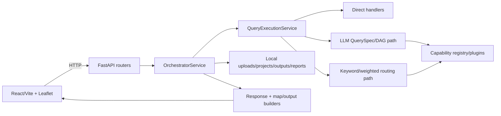

# Current system architecture

## Confirmed active architecture

`api/main.py:105-113` creates one process-local `OrchestratorService` and registers each router twice (unversioned plus `/api/v1`). `OrchestratorService.__init__` (`service.py:419-560`) composes the registry, file stores, project/data source services, upload resolver, response builder, feedback/weight services and query execution service.

The active implementation crosses the `orchestrator` and `smart_spatial_system` boundaries: `orchestrator/query_execution_service.py` merely re-exports `smart_spatial_system.application.services.query_execution_service.QueryExecutionService`. That service receives the orchestrator as a dynamic context and delegates methods back to it via `__getattr__` (`query_execution_service.py:528-537`).

## Architectural weaknesses

- The dependency direction is inverted: the purported application layer imports numerous orchestrator modules, while its context reaches back into the facade.
- The API response is normalized at three layers: execution/production response, API `_normalize_query_response_for_frontend` (`query_planner.py:114-279`), then frontend recursive normalizers. There is no single authoritative response DTO.
- An experimental kernel bridge is present but disabled by default (`service.py:243-253`); the regular DAG and legacy router are independently executable paths.
- `CapabilityRegistry.from_plugin_modules(..., tolerant=True)` (`service.py:455-458`) can silently omit import-failing plugin modules, making runtime capabilities environment-dependent.
